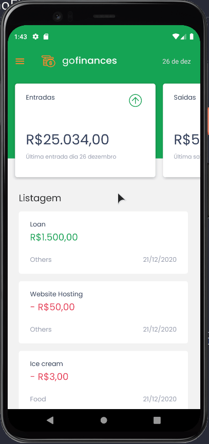

<h1 align="center">GoFinances - mobile</h1>

<p align="center">
  

  <a href="https://www.linkedin.com/in/helitonoliveira/">
    
  </a>

  

  <a href="https://github.com/helitonoliveiraa/gofinances-mobile/stargazers">
    
  </a>
</p>


<p align="center">
  <a href="#memo-sobre-o-desafio">Sobre</a>&nbsp;&nbsp;&nbsp;|&nbsp;&nbsp;&nbsp;
  <a href="#wrench-ferramentas-utilizadas">Ferramentas utilizadas</a>&nbsp;&nbsp;&nbsp;|&nbsp;&nbsp;&nbsp;
  <a href="#arrowdown-como-clonar-o-projeto">Baixe o projeto</a>&nbsp;&nbsp;&nbsp;|&nbsp;&nbsp;&nbsp;
  <a href="#pagefacingup-licença">Licença</a>
</p>

<p align="center">
  
</p>

<br />

## :memo: Sobre o desafio

Nesse desafio, tive de realizar a conexão desta aplicação (mobile) com a API desenvolvida no desafio anterior [desafio 06](https://github.com/helitonoliveiraa/desafio-typeorm-upload).

é desafio bonus, onde a partir de um layout tive de desenvolver o app totalmente do zero.
<br /><br />
Versão Web da aplicação: [GoFinances Web](https://github.com/helitonoliveiraa/desafio-fundamentos-reactjs)

## :wrench: Ferramentas utilizadas

- [React Native](https://reactnative.dev/)
- [React Nativagion](https://reactnavigation.org/docs/hello-react-navigation/)
- [Styled Components](https://styled-components.com/docs)
- [Polished](https://polished.js.org/)
- [Date-fns](https://date-fns.org/)
- [Axios](https://github.com/axios/axios)
- [ESlint](https://eslint.org/)
- [EditorConfig](https://editorconfig.org/)

## :arrow_down: Como baixar o projeto

**Observação**: é preciso ter instalado e configurando um emulador como o [Android Studio](https://developer.android.com/studio) em sua maquina.<br />

caso tenha dificuldade em configurar seu ambiente de desenvolvimento com o emulador, siga o passo a passo descrito neste tutorial: [Clique Aqui!](https://react-native.rocketseat.dev/android/emulador) <br />

`antes de rodar o projeto, abra o emulador` <br />
**rode o projeto**<br />

```bash
# clone o projeto
$ git clone https://github.com/helitonoliveiraa/gofinances-mobile.git

# acesse a pasta do projeto
$ cd gofinances-mobile

# start o bundle do projeto
$ yarn start

# rode o projeto no emulador
$ yarn android
```

<br />

## :page_facing_up: Licença

Esse projeto está sob a licença MIT. Veja o arquivo [LICENSE](https://github.com/helitonoliveiraa/gofinances-mobile/blob/main/LICENSE) para mais detalhes.<br /><br /><br />

<p align="center">Feito com 💚 by <a href="https://www.linkedin.com/in/helitonoliveira/" target="_blank">Héliton Oliveira</a></p>
